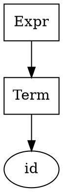

# Bottom-Up Parser Implementation (SLR(1) and LR(1))

## Team Information
- **Assignment**: Compiler Construction Assignment 3
- **Language**: C++
- **Tools**: Graphviz for parse tree visualization

## Overview

This project implements complete **SLR(1)** and **LR(1) parsers** that:
1. Read Context-Free Grammars (CFG) from text files
2. Augment grammars with new start symbol
3. Construct canonical LR(0) and LR(1) item sets
4. Build SLR(1) and LR(1) parsing tables
5. Parse input strings using shift-reduce algorithm
6. Generate parse trees with graphviz output

## Project Structure

```
assignment3/
├── src/
│   ├── Token.h / Token.cpp           # Symbol and production definitions
│   ├── Grammar.h / Grammar.cpp       # Grammar loading and augmentation
│   ├── Items.h / Items.cpp           # LR(0) and LR(1) item sets
│   ├── Stack.h / Stack.cpp           # Parsing stack implementation
│   ├── ParsingTable.h / ParsingTable.cpp  # Action/Goto tables
│   ├── SLRParser.h / SLRParser.cpp   # SLR(1) parser
│   ├── LR1Parser.h / LR1Parser.cpp   # LR(1) parser
│   ├── Tree.h / Tree.cpp             # Parse tree with graphviz support
│   └── main.cpp                      # Interactive menu system
│
├── input/                    # Grammar files
│   ├── grammar1.txt         # Simple expression grammar
│   ├── grammar2.txt         # Expression with multiplication
│   ├── grammar3.txt         # LR(1) vs SLR(1) example
│   └── grammar4.txt         # Dangling else problem
│
├── output/                   # Generated results
│   ├── augmented_grammar.txt
│   ├── slr_items.txt
│   ├── slr_parsing_table.txt
│   ├── lr1_items.txt
│   ├── lr1_parsing_table.txt
│   ├── slr_parse_tree.gv    # Graphviz format
│   └── lr1_parse_tree.gv
│
├── Makefile                 # Build configuration
└── README.md               # This file
```

## Compilation

### Prerequisites
- MinGW/GCC with C++11 support (Windows)
- Or any standard C++ compiler (Linux/Mac)
- Graphviz installed (for viewing parse trees)

### Build Instructions

#### Windows (with MinGW):
```bash
# Navigate to project directory
cd path/to/assignment3

# Build
make

# Or clean and rebuild
make rebuild

# Run
make run
```

#### Linux/Mac:
```bash
# Same commands work on Linux/Mac
make
make run
```

#### Manual Compilation:
```bash
g++ -std=c++11 -Wall -O2 -o bin/parser.exe src/*.cpp
```

## Usage

### Running the Parser

```bash
./bin/parser.exe
```

This opens an interactive menu with options:

```
=== Parser Comparison Tool ===
1. Load Grammar
2. Build SLR(1) Parser
3. Build LR(1) Parser
4. Parse String (SLR)
5. Parse String (LR1)
6. Display Canonical Collections
7. Display Parsing Tables
8. Save Results to Files
9. Compare Parsers
10. Exit
```

### Example Session

```bash
# 1. Load Grammar
Enter grammar file path: input/grammar1.txt

# 2. Build SLR(1) Parser
(Builds canonical collection and parsing table)

# 3. Build LR(1) Parser
(Builds LR(1) item sets and parsing table)

# 4. Parse String (SLR)
Enter input string to parse: id+id

# 7. Display Parsing Tables
(Shows ACTION and GOTO tables for both parsers)

# 9. Compare Parsers
(Shows state count differences)
```

## Input File Format

### Grammar File Format

**File**: `input/grammar1.txt`

```
Expr -> Expr + Term | Term
Term -> Factor
Factor -> id
```

**Rules:**
- One production per line
- Format: `NonTerminal -> production1 | production2 | ...`
- Use `->` as arrow symbol
- Use `|` to separate alternatives
- Terminals: lowercase letters, operators (e.g., `+`, `*`, `(`, `)`)
- Terminals with names: `id`, `if`, `then`, `else`, `other`
- Non-terminals: Multi-character names starting with uppercase (e.g., `Expr`, `Term`, `Factor`)
- Epsilon: use `epsilon` or `@`

### Valid Input Examples

**Example 1: Simple Expression**
```
Expr -> Expr + Term | Term
Term -> Factor
Factor -> id
```

**Example 2: With Multiplication and Parentheses**
```
Expr -> Expr + Term | Term
Term -> Term * Factor | Factor
Factor -> ( Expr ) | id
```

**Example 3: LR(1) but not SLR(1)**
```
Start -> L = R | R
L -> * R | id
R -> L
```

**Example 4: Dangling Else**
```
Stmt -> if Expr then Stmt | if Expr then Stmt else Stmt | other
Expr -> id
```

## Code Examples

### Parsing Strings

```cpp
// Load and augment grammar
Grammar grammar;
grammar.loadFromFile("input/grammar1.txt");
grammar.augmentGrammar();

// Build SLR(1) parser
SLRParser slrParser(grammar);
slrParser.build();

// Parse a string
vector<Symbol> input;
input.push_back(Symbol("id", TERMINAL));
input.push_back(Symbol("+", TERMINAL));
input.push_back(Symbol("id", TERMINAL));

ParseTree* tree = nullptr;
if (slrParser.parse(input, tree)) {
    tree->saveTreeToGraphviz("output/parse_tree.gv");
    delete tree;
}
```

### Building Parsers

```cpp
// Create grammar
Grammar grammar;
grammar.loadFromFile("input/grammar2.txt");
grammar.augmentGrammar();

// Build both parsers
SLRParser slrParser(grammar);
LR1Parser lr1Parser(grammar);

slrParser.build();
lr1Parser.build();

// Save results
slrParser.saveCanonicalCollectionToFile("output/slr_items.txt");
slrParser.saveParsingTableToFile("output/slr_parsing_table.txt");

lr1Parser.saveCanonicalCollectionToFile("output/lr1_items.txt");
lr1Parser.saveParsingTableToFile("output/lr1_parsing_table.txt");

// Compare
cout << "SLR(1) states: " << slrParser.getNumberOfStates() << endl;
cout << "LR(1) states: " << lr1Parser.getNumberOfStates() << endl;
```

## Key Algorithms

### CLOSURE Operation (LR(0))
```
For each item A -> α • B β in I:
  For each production B -> γ:
    Add B -> • γ to closure(I)
```

### CLOSURE Operation (LR(1))
```
For each item [A -> α • B β, a] in I:
  For each production B -> γ:
    For each terminal b in FIRST(βa):
      Add [B -> • γ, b] to closure(I)
```

### GOTO Operation
```
GOTO(I, X):
  Find all items A -> α • X β in I
  Move dot: A -> α X • β
  Return closure of these items
```

### Shift-Reduce Parsing

1. Initialize: Stack = [0], Input with $
2. Repeat:
   - Let s = top state, a = current symbol
   - If ACTION[s, a] = shift t: push a, push t, advance
   - If ACTION[s, a] = reduce p: pop symbols, push A, push GOTO[t, A]
   - If ACTION[s, a] = accept: parsing successful
   - If ACTION[s, a] = error: parsing failed

## Output Files

### Canonical Collection (`.txt`)
Lists all item sets with state numbers:
```
I0:
  ExprPrime -> • Expr
  Expr -> • Expr + Term
  Expr -> • Term
  Term -> • Factor
  Factor -> • id

I1:
  ExprPrime -> Expr •
  Expr -> Expr • + Term
```

### Parsing Table (`.txt`)
ACTION and GOTO entries:
```
State | + | * | ( | ) | id | $ | Expr | Term | Factor
I0    |   |   |   |   | s5 |   | 1    | 2    | 3
I1    | s6|   |   |   |    | ac|      |      |
```

### Parse Trees (`.gv`)
Graphviz format for visualization:


Generate PNG/PDF from graphviz:
```bash
dot -Tpng output/parse_tree.gv -o output/parse_tree.png
dot -Tpdf output/parse_tree.gv -o output/parse_tree.pdf
```

## Features

### SLR(1) Parser
- ✓ Loads arbitrary CFGs
- ✓ Augments grammar
- ✓ Computes FIRST and FOLLOW sets
- ✓ Builds LR(0) canonical collection
- ✓ Generates SLR(1) parsing table
- ✓ Performs shift-reduce parsing
- ✓ Reports shift/reduce conflicts

### LR(1) Parser
- ✓ Uses lookahead in items
- ✓ Builds LR(1) canonical collection
- ✓ Generates LR(1) parsing table
- ✓ More powerful than SLR(1)
- ✓ Resolves some SLR(1) conflicts
- ✓ Generally produces more states

### Parse Tree Generation
- ✓ Tracks reduction steps
- ✓ Builds AST
- ✓ Graphviz output
- ✓ Text-based tree display

## Test Cases

### Grammar 1: Simple Expression
```
Expr -> Expr + Term | Term
Term -> Factor
Factor -> id
```
- Valid: `id`, `id+id`, `id+id+id`
- Invalid: `id+`, `++id`

### Grammar 2: With Operators
```
Expr -> Expr + Term | Term
Term -> Term * Factor | Factor
Factor -> ( Expr ) | id
```
- Valid: `id*id+id`, `(id+id)*id`
- Tests operator precedence

### Grammar 3: LR(1) vs SLR(1)
```
Start -> L = R | R
L -> * R | id
R -> L
```
- This grammar is **LR(1) but NOT SLR(1)**
- LR(1) has fewer conflicts
- Demonstrates LR(1) superiority

### Grammar 4: Dangling Else
```
Stmt -> if Expr then Stmt | if Expr then Stmt else Stmt | other
Expr -> id
```
- Tests conflict resolution
- Classic parser design problem

## Known Limitations

1. **Epsilon Productions**: Limited support for ε in complex grammars
2. **Memory**: Large grammars may use significant memory
3. **Error Recovery**: No sophisticated error recovery
4. **Parse Tree**: Simplified tree generation (full semantic actions not included)
5. **Input Parsing**: Simple tokenization (no complex lexer)
6. **Graphviz**: Requires graphviz installed for visualization

## Compilation Notes

### For Visual Studio (Windows):
```bash
# Create new C++ console project
# Add all .h and .cpp files from src/
# Build solution
```

### For Code::Blocks:
```bash
# Create new C++ project
# Add all files
# Build
```

## Performance

- **SLR(1) vs LR(1)**: LR(1) typically generates 10-30% more states
- **Parsing Speed**: Both use O(n) time for input of length n
- **Memory**: Tables stored as hash maps for efficiency

## Troubleshooting

### Compilation Errors
```
error: undefined reference to 'Grammar::Grammar()'
```
→ Make sure all .cpp files are compiled together

### Parse Tree Not Generated
→ Check that parsing was successful
→ Verify symbols in input match grammar terminals

### Graphviz File Won't Open
→ Ensure graphviz is installed
→ Use: `dot -Tpng file.gv -o file.png`

## Future Enhancements

1. LALR(1) parser implementation
2. Full semantic action support
3. Better error recovery
4. Grammar conflict resolution suggestions
5. Performance profiling
6. Interactive parse tree viewer

## References

- Compilers: Principles, Techniques, and Tools (Dragon Book)
- Aho, Sethi, Ullman - Engineering a Compiler
- Donald Knuth - The Art of Computer Programming

## Notes

- Code is intentionally simple and readable
- Avoid `auto` keyword for clarity
- Use standard library containers
- Follow C++11 standard
- No external dependencies except optional graphviz

---

**Last Updated**: April 2026
**Status**: Implementation Phase
